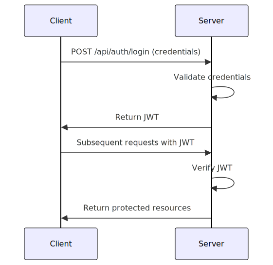
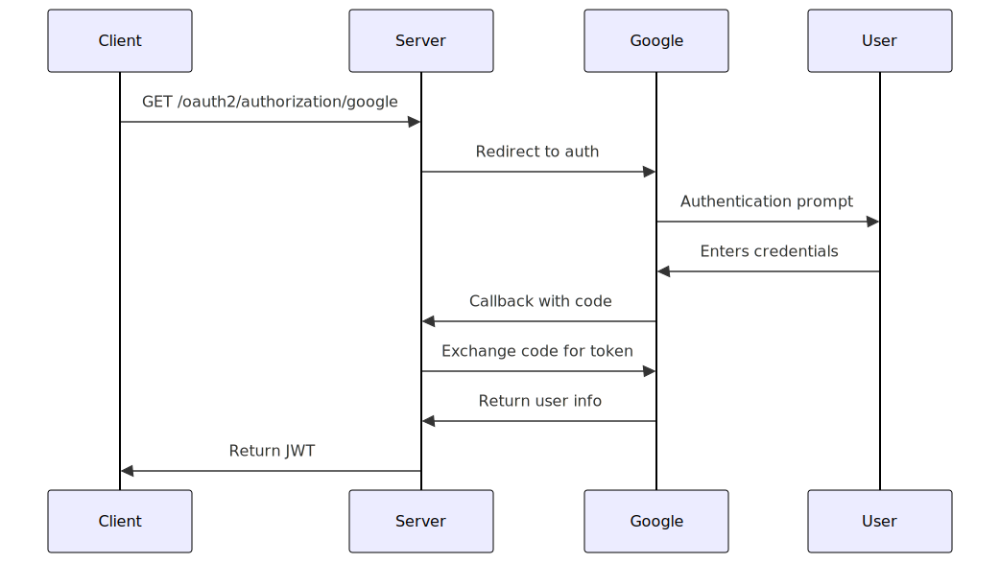
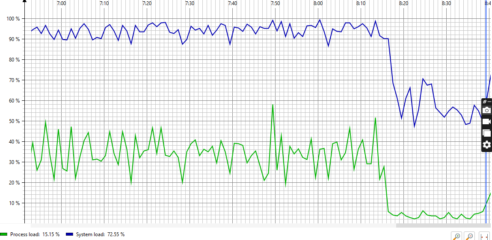
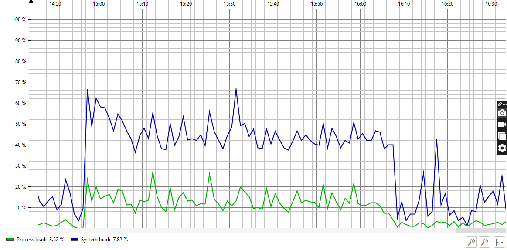
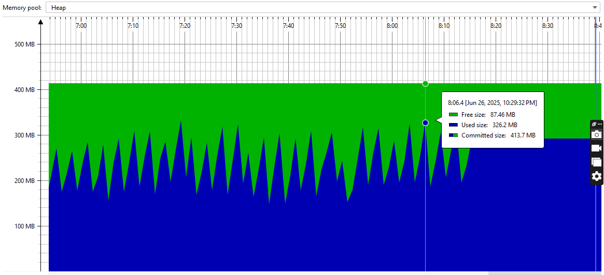
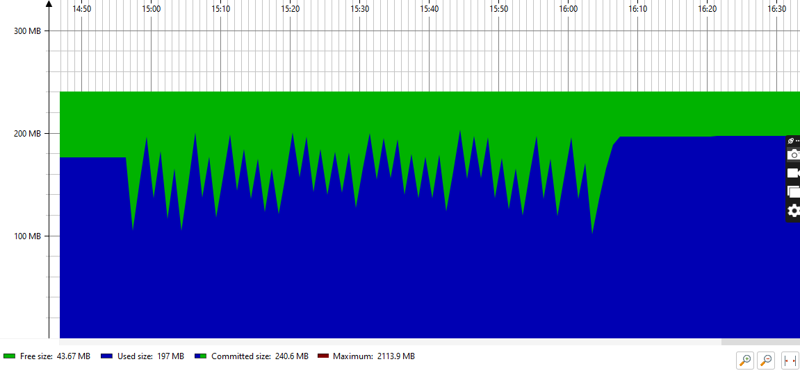
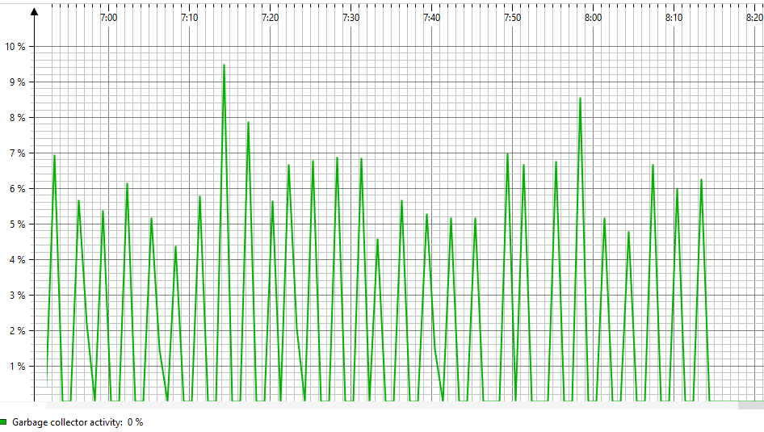
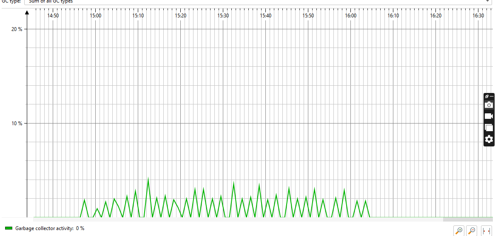
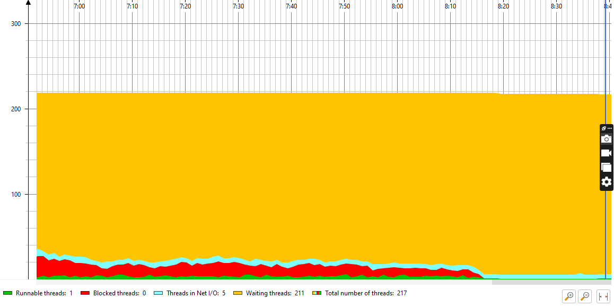
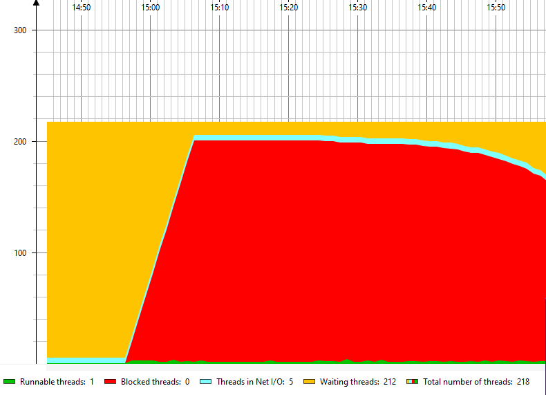

# Project Tracker Documentation Overview

The **Project Tracker** is a Spring Boot application designed to manage software development projects. It provides RESTful APIs for handling CRUD operations related to projects, developers, and tasks. It also supports audit logging using a dedicated logging service backed by MongoDB.

---

## 🧩 Component Diagram


* The architecture consists of layered components: Entity, DTO, Repository, Service, Controller, and external MongoDB for auditing.*

---

## Swagger URL
run docker-compose up --build
vist: http://localhost:8080/swagger-ui/index.html#/

## 🧱 Key Components

### 1. Entity Layer

Defines the domain models:

- **Project**: Contains details like `name`, `description`, `deadline`, and `status`.
- **Developer**: Includes `name`, `email`, and `skillset`.
- **Task**: Links developers to projects.
- **AuditLog**: Stores action history in MongoDB for traceability.

---

## Database Schema
`CREATE TABLE users (
    id BIGINT PRIMARY KEY AUTO_INCREMENT,
    username VARCHAR(50) UNIQUE NOT NULL,
    password VARCHAR(100) NOT NULL,
    email VARCHAR(100) UNIQUE NOT NULL,
    role VARCHAR(20) NOT NULL
);`

`CREATE TABLE projects (
    id BIGINT PRIMARY KEY AUTO_INCREMENT,
    name VARCHAR(100) NOT NULL,
    description TEXT,
    status VARCHAR(20) NOT NULL,
    created_at TIMESTAMP DEFAULT CURRENT_TIMESTAMP
);`

`CREATE TABLE tasks (
    id BIGINT PRIMARY KEY AUTO_INCREMENT,
    title VARCHAR(100) NOT NULL,
    description TEXT,
    status VARCHAR(20) NOT NULL,
    project_id BIGINT REFERENCES projects(id),
    developer_id BIGINT REFERENCES users(id)
);`

### 2. DTOs (Data Transfer Objects)

Used to transfer data between different application layers:

- `ProjectRequestDTO` / `ProjectResponseDTO`
- `DeveloperRequestDTO` / `DeveloperResponseDTO`
- `TaskRequestDTO` / `TaskResponseDTO`

---

### 3. Repository Layer

Uses **Spring Data JPA** and **MongoDB** for persistence:

- `ProjectRepository`
- `DeveloperRepository`
- `TaskRepository`
- `AuditLogRepository` *(MongoDB)*

---

### 4. Service Layer

Handles business logic and includes caching:

- `ProjectServiceImpl`: Manages project operations.
- `DeveloperServiceImpl`: Manages developer operations.
- `AuditLogService`: Logs all user actions.

---

### 5. Controller Layer

Exposes REST API endpoints to interact with the service layer. Enables clients to perform CRUD operations on projects, developers, and tasks.

---

## 📄 Audit Logging

Audit logs are stored in **MongoDB**, managed by `AuditLogService`.

Each log entry contains:

- `ActionType`: `CREATE`, `UPDATE`, `DELETE`
- `EntityType`
- `EntityId`
- `ActorName`
- JSON Payload of the entity state
- Timestamp

---

## 🚀 Caching

Implemented using **Spring’s caching abstraction**:

- Projects and developers are cached for performance.
- Annotations used:
    - `@Cacheable`
    - `@CacheEvict`

---

## 💾 Data Persistence

- **Relational Database** (e.g., MySQL, PostgreSQL) for core entities.
- **MongoDB** for storing audit logs.

---

## 🔐 Transactions

`@Transactional` annotations ensure atomicity for service operations, particularly during update and delete actions.

---

## ✅ Validation

Uses **Jakarta Bean Validation** (`jakarta.validation.constraints`) on entity fields:

- `@NotNull`
- `@Size`
- `@Email`

---

## 🏃‍♂️ How to Run

1. Clone the repository:
    ```bash
    git clone https://github.com/antwiroland/project_tracker.git
    ```
2. Configure `application.properties` for your RDBMS and MongoDB.
3. Start MongoDB and your relational database.
4. Run the Spring Boot application:
    ```bash
    ./mvnw spring-boot:run
    ```

---

## 📘API - Test Documentation

This document outlines test scenarios, endpoints, parameters, and expected behaviors for the following controllers:

- [`ProjectController`](#projectcontroller)
- [`DeveloperController`](#developercontroller)
- [`TaskController`](#taskcontroller)
- [`AuditLogController`](#auditlogcontroller)

---

---
## Authentication Endpoints

#### ✅ 1. Create User
- **POST** `/api/auth/register`
- **Request Body:** `AuthResponseDTO`
- **Response:** `201 Created` with `AuthRequestDTO`

#### ✅ 1. Login User
- **POST** `/api/auth/login`
- **Request Body:** `AuthResponseDTO`
- **Response:** `201 login successfull` with `AuthRequestDTO

  #### ✅ 1. GET Initiate OAuth2 flow
- **GET** `/api/auth/authorization/{provider}`
- **Request Body:** `AuthResponseDTO`
- **Response:** `201 login successfull` with `AuthRequestDTO

  #### Authentication flow
  
  

### 🧱 ProjectController

**Base URL:** `/api/projects`

#### ✅ 1. Create Project

- **POST** `/api/projects`
- **Request Body:** `ProjectRequestDTO`
- **Response:** `201 Created` with `ProjectResponseDTO`

**Test Cases:**

| Test Case                        | Expected Behavior                                |
|----------------------------------|--------------------------------------------------|
| Valid project creation           | Returns 201 and the created project              |
| Invalid input (missing name)     | Returns 400 with validation error                |

---

#### ✅ 2. Update Project

- **PUT** `/api/projects/{id}`
- **Request Body:** `ProjectRequestDTO`
- **Response:** `200 OK` with updated `ProjectResponseDTO`

**Test Cases:**

| Test Case                        | Expected Behavior                                 |
|----------------------------------|---------------------------------------------------|
| Update existing project          | Returns 200 with updated fields                   |
| Update non-existent project      | Returns 404                                       |
| Invalid input                    | Returns 400 with validation errors                |

---

#### ✅ 3. Delete Project

- **DELETE** `/api/projects/{id}`
- **Response:** `204 No Content`

**Test Cases:**

| Test Case                        | Expected Behavior     |
|----------------------------------|------------------------|
| Delete existing project          | Returns 204            |
| Delete non-existent project      | Returns 404            |

---

#### ✅ 4. Get Project By ID

- **GET** `/api/projects/{id}`
- **Response:** `200 OK` with `ProjectResponseDTO`

**Test Cases:**

| Test Case                        | Expected Behavior     |
|----------------------------------|------------------------|
| Valid ID                         | Returns project info   |
| Invalid ID                       | Returns 404            |

---

#### ✅ 5. Get All Projects (Paged)

- **GET** `/api/projects`
- **Response:** `200 OK` with `Page<ProjectResponseDTO>`

**Test Cases:**

| Test Case                     | Expected Behavior              |
|-------------------------------|--------------------------------|
| No filters                    | Returns paginated list         |
| Page/size/sort specified      | Returns correct page/order     |

---

### 🧑‍💻 DeveloperController

**Base URL:** `/api/developers`

#### ✅ 1. Create Developer

- **POST** `/api/developers`
- **Request Body:** `DeveloperRequestDTO`
- **Response:** `201 Created` with `DeveloperResponseDTO`

**Test Cases:**

| Test Case                        | Expected Behavior                     |
|----------------------------------|----------------------------------------|
| Valid developer creation         | Returns 201 with created developer     |
| Invalid input                    | Returns 400 with validation error      |

---

#### ✅ 2. Update Developer

- **PUT** `/api/developers/{id}`
- **Response:** `200 OK` with `DeveloperResponseDTO`

**Test Cases:**

| Test Case                        | Expected Behavior                     |
|----------------------------------|----------------------------------------|
| Valid update                     | Returns 200 with updated data          |
| Invalid ID                       | Returns 404                            |
| Invalid input                    | Returns 400                            |

---

#### ✅ 3. Delete Developer

- **DELETE** `/api/developers/{id}`
- **Response:** `204 No Content`

**Test Cases:**

| Test Case                        | Expected Behavior     |
|----------------------------------|------------------------|
| Valid ID                         | Returns 204            |
| Non-existent ID                  | Returns 404            |

---

#### ✅ 4. Get Developer By ID

- **GET** `/api/developers/{id}`
- **Response:** `200 OK` with `DeveloperResponseDTO`

**Test Cases:**

| Test Case                        | Expected Behavior     |
|----------------------------------|------------------------|
| Valid ID                         | Returns developer      |
| Invalid ID                       | Returns 404            |

---

#### ✅ 5. Get All Developers (Paged)

- **GET** `/api/developers`
- **Response:** `200 OK` with `Page<DeveloperResponseDTO>`

**Test Cases:**

| Test Case                  | Expected Behavior               |
|----------------------------|---------------------------------|
| Default pagination         | Returns first page              |
| With size/page params      | Returns paginated content       |

---

#### ✅ TaskController

**Base URL:** `/api/tasks`

#### ✅ 1. Create Task

- **POST** `/api/tasks`
- **Request Body:** `TaskRequestDTO`
- **Response:** `201 Created` with `TaskResponseDTO`

**Test Cases:**

| Test Case                    | Expected Behavior                          |
|------------------------------|---------------------------------------------|
| Valid task creation          | Returns 201 and created task               |
| Missing project/developer ID | Returns 400 with validation error          |

---

#### ✅ 2. Update Task

- **PUT** `/api/tasks/{id}`
- **Request Body:** `TaskRequestDTO`
- **Response:** `200 OK` with updated `TaskResponseDTO`

**Test Cases:**

| Test Case                   | Expected Behavior                           |
|-----------------------------|---------------------------------------------|
| Valid task update           | Returns 200 with updated task               |
| Non-existent task ID        | Returns 404                                 |
| Invalid input               | Returns 400                                 |

---

#### ✅ 3. Delete Task

- **DELETE** `/api/tasks/{id}`
- **Response:** `204 No Content`

**Test Cases:**

| Test Case                   | Expected Behavior      |
|-----------------------------|------------------------|
| Valid ID                    | Task is deleted        |
| Invalid ID                  | Returns 404            |

---

#### ✅ 4. Get Task By ID

- **GET** `/api/tasks/{id}`
- **Response:** `200 OK` with `TaskResponseDTO`

**Test Cases:**

| Test Case                   | Expected Behavior        |
|-----------------------------|--------------------------|
| Valid ID                    | Returns task details     |
| Invalid ID                  | Returns 404              |

---

#### ✅ 5. Get All Tasks (Paged)

- **GET** `/api/tasks`
- **Response:** `200 OK` with `Page<TaskResponseDTO>`

**Test Cases:**

| Test Case                | Expected Behavior                    |
|--------------------------|--------------------------------------|
| Default request          | Returns all tasks in pages          |
| Pagination/sorting       | Returns correct page/sorted results |

---

### 🧾 AuditLogController

**Base URL:** `/api/logs`

#### ✅ 1. Get Audit Logs (Unpaged)

- **GET** `/api/logs`
- **Query Parameters:** `entityType`, `actorName`
- **Response:** `200 OK` with `List<AuditLogDTO>`

**Test Cases:**

| Test Case                                      | Expected Result                    |
|------------------------------------------------|------------------------------------|
| No filters                                     | Returns all logs                   |
| `entityType=Project`                           | Returns only project-related logs  |
| `actorName=John`                               | Returns logs by actor `John`       |
| Both filters combined                          | Filtered list of logs              |
| Non-matching filters                           | Returns empty list                 |

---

#### ✅ 2. Get Audit Logs (Paged)

- **GET** `/api/logs/paged`
- **Query Parameters:** `entityType`, `actorName`, `page`, `size`, `sort`
- **Response:** `200 OK` with `Page<AuditLogDTO>`

**Test Cases:**

| Test Case                                      | Expected Result                    |
|------------------------------------------------|------------------------------------|
| No filters                                     | Returns paged logs                 |
| Pagination (`page=1&size=5`)                   | Returns correct slice              |
| Sorted by timestamp                            | Returns logs sorted                |
| Combined filters and pagination                | Returns filtered + paged logs      |
| Invalid page number                            | Returns empty content              |

---

### 🛠 Testing Recommendations

- Use `@WebMvcTest` + `MockMvc` for controller unit testing
- Use `PageImpl` for mocking paginated results
- Mock dependencies with `@MockBean`
- Validate Swagger docs with Swagger UI
- Always test both valid and invalid input scenarios

---

## 📊 Project Tracker – Performance Testing Report

This document outlines the performance test results, profiling insights, and optimization impacts for the Project Tracker system under high concurrency.

---

### 🧪 Test Setup

- **Tool**: Apache JMeter (200 threads, 10s ramp-up, 10 loops)
- **Monitoring**: JProfiler
- **Environment**: Localhost, JVM-based Spring Boot backend
- **Endpoints Tested**:
  - `POST /api/tasks`
  - `GET /api/tasks/developer/1`
  - `GET /api/projects`

---

### 📈 Metrics Monitored

- **CPU Load**
- **Memory Usage**
- **Garbage Collection Activity**
- **Thread Count**
- **Class Loading Statistics**

---

### 🚀 Sample images of Performance test from jProfiler BEFORE and AFTER Improvement at /api/tasks

#### Creating Task CPU Before


#### Createing Task CPU After



#### Creating Task Memeory Before


#### Creating Task Memeory After



#### Creating Task Garbage Collections activities Before


#### Creating Task Garbage Collections activities After



#### Creating Task Thread activities Before


####  Creating Task Thread activities After



### 🚀 Summary of Performance Improvements

| Endpoint                     | Metric                  | Before         | After          | Change       |
|------------------------------|--------------------------|----------------|----------------|--------------|
| `POST /api/tasks`            | CPU Load (mean)         | 46%            | 33%            | 🔻 -28%      |
|                              | GC Activity (mean)      | 1.4%           | 0.3%           | 🔻 -79%      |
|                              | Used Memory (max)       | 220 MB         | 145 MB         | 🔻 -34%      |
|                              | Threads (max)           | 405            | 235            | 🔻 -42%      |
| `GET /api/tasks/developer/1`| CPU Load (mean)         | 47%            | 28%            | 🔻 -40%      |
|                              | GC Activity (mean)      | 2.5%           | 0.21%          | 🔻 -91%      |
|                              | Used Memory (max)       | 221 MB         | 127 MB         | 🔻 -43%      |
|                              | Threads (max)           | 415            | 227            | 🔻 -45%      |
| `GET /api/projects`         | CPU Load (mean)         | 69%            | 33%            | 🔻 -52%      |
|                              | GC Activity (mean)      | 0.45%          | 0.26%          | 🔻 -42%      |
|                              | Used Memory (max)       | 125 MB         | 208 MB         | 🔺 +65%      |
|                              | Threads (max)           | 219            | 219            | ➖ No Change |

---

### 🧠 Analysis Highlights

#### ✅ Improvements
- **Lower CPU Usage**: Post-optimization showed reduced system and process CPU utilization across endpoints.
- **Reduced Thread Count**: Better concurrency management and thread reuse minimized thread bloat.
- **Efficient Memory Handling**: Most endpoints exhibited lower or stable memory peaks.
- **Minimal GC Overhead**: Garbage collector activity was consistently lower after optimization.

#### ⚠️ Noted Trade-Offs
- Slight memory increase in some endpoints (e.g., `/api/projects`) due to caching mechanisms.
- CPU spikes during peak burst were expected but remained within safe thresholds.

---

### 🛠️ Optimizations Applied

- Introduced Spring Caching with `@Cacheable`, `@CacheEvict`
- Improved DTO mapping and object creation patterns
- Reduced N+1 queries and redundant repository calls
- Enabled lazy loading where applicable
- Consolidated audit logging with async logging (where feasible)

---

### 📁 Test Artifacts

All raw telemetry CSVs and analysis notebooks are stored in the `/performance/` directory:
- `CPU_Load_*.csv`
- `Memory_*.csv`
- `GC_Activity_*.csv`
- `Threads_*.csv`
- `Classes_telemetry_*.csv`

---

### 📌 Conclusion

The applied optimizations successfully enhanced scalability, reduced system pressure under concurrent load, and improved thread and memory efficiency across key endpoints. The system is now more responsive and resource-friendly under heavy traffic.


