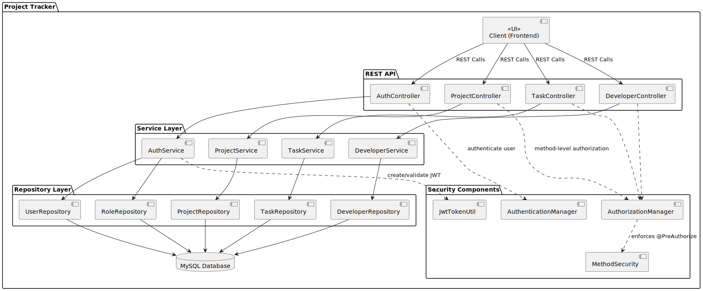

# Project Tracker Documentation Overview

The **Project Tracker** is a Spring Boot application designed to manage software development projects. It provides RESTful APIs for handling CRUD operations related to projects, developers, and tasks. It also supports audit logging using a dedicated logging service backed by MongoDB.

---

## 🧩 Component Diagram




* The architecture consists of layered components: Entity, DTO, Repository, Service, Controller, and external MongoDB for auditing.*

---

## 🧱 Key Components

### 1. Entity Layer

Defines the domain models:

- **Project**: Contains details like `name`, `description`, `deadline`, and `status`.
- **Developer**: Includes `name`, `email`, and `skillset`.
- **Task**: Links developers to projects.
- **AuditLog**: Stores action history in MongoDB for traceability.

---

### 2. DTOs (Data Transfer Objects)

Used to transfer data between different application layers:

- `ProjectRequestDTO` / `ProjectResponseDTO`
- `DeveloperRequestDTO` / `DeveloperResponseDTO`
- `TaskRequestDTO` / `TaskResponseDTO`

---

### 3. Repository Layer

Uses **Spring Data JPA** and **MongoDB** for persistence:

- `ProjectRepository`
- `DeveloperRepository`
- `TaskRepository`
- `AuditLogRepository` *(MongoDB)*

---

### 4. Service Layer

Handles business logic and includes caching:

- `ProjectServiceImpl`: Manages project operations.
- `DeveloperServiceImpl`: Manages developer operations.
- `AuditLogService`: Logs all user actions.

---

### 5. Controller Layer

Exposes REST API endpoints to interact with the service layer. Enables clients to perform CRUD operations on projects, developers, and tasks.

---

## 📄 Audit Logging

Audit logs are stored in **MongoDB**, managed by `AuditLogService`.

Each log entry contains:

- `ActionType`: `CREATE`, `UPDATE`, `DELETE`
- `EntityType`
- `EntityId`
- `ActorName`
- JSON Payload of the entity state
- Timestamp

---

## 🚀 Caching

Implemented using **Spring’s caching abstraction**:

- Projects and developers are cached for performance.
- Annotations used:
    - `@Cacheable`
    - `@CacheEvict`

---

## 💾 Data Persistence

- **Relational Database** (e.g., MySQL, PostgreSQL) for core entities.
- **MongoDB** for storing audit logs.

---

## 🔐 Transactions

`@Transactional` annotations ensure atomicity for service operations, particularly during update and delete actions.

---

## ✅ Validation

Uses **Jakarta Bean Validation** (`jakarta.validation.constraints`) on entity fields:

- `@NotNull`
- `@Size`
- `@Email`

---

## 🏃‍♂️ How to Run

1. Clone the repository:
    ```bash
    git clone https://github.com/antwiroland/project_tracker.git
    ```
2. Configure `application.properties` for your RDBMS and MongoDB.
3. Start MongoDB and your relational database.
4. Run the Spring Boot application:
    ```bash
    ./mvnw spring-boot:run
    ```

---

## 🔮 Future Enhancements

- Add **authentication and role-based access control**.
- Expand **AuditLog** to include request metadata:
    - IP Address
    - Request Headers
---
